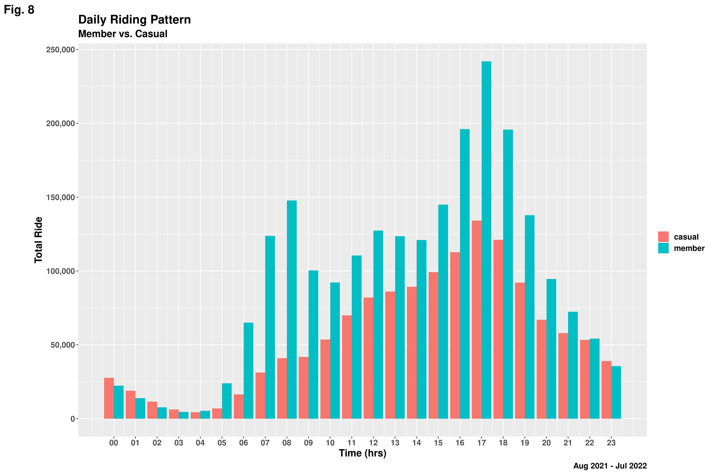

/cdn.vox-cdn.com/uploads/chorus_image/image/60438451/shutterstock_525161920.0.jpg)

<h2 align='center'>How to Improve Chicago-Divvy's Future Success by Maximizing the Number of Annual Memberships</h2>

## Updated: September 10, 2022

# Table of Contents
- [Introduction](#intro)
     - [Background](#background)
     - [Divvy Bikes](#divvy)
     - [About the data](#data)
     - [Methodology](#method)
- [Phase One: Ask](#ask)
- [Phase Two: Prepare](#prepare)
- [Phase Three: Process](#process)
- [Phase Four: Analysis](#analyse)
- [Phase Five: Visualization](#viz)
- [Phase Five: Share](#share)
- [Phase Six: Recommendation](#act)
- [Limitations](#limit)
- [Resources](#resources)

# Background
As a junior data analyst working in the marketing analyst team at Cyclistic, a bike-share company in Chicago. The director of marketing believes the company’s future success depends on maximizing the number of annual memberships. Therefore, my team wants to understand how casual riders and annual members use Cyclistic bikes differently. From these insights, the marketing team will design a new marketing strategy to convert casual riders into annual members.
Read [more](https://d3c33hcgiwev3.cloudfront.net/aacF81H_TsWnBfNR_x7FIg_36299b28fa0c4a5aba836111daad12f1_DAC8-Case-Study-1.pdf?Expires=1662681600&Signature=BpMkr1QA6pHmRZQrvA4hLcaOg7~GEDdV3zNZHpJxQ2G4u0bqCswVvXMaCGEEAxvBrkxwq70R7E2wFXKh-a2cjc4eTBGBuLBsSkOWqIEFahp965JhL1GN3qkVCVot2UabhxOv64Ijb2G7sWqWs2129wG1U9JBY5CReLVtPm8FQ3E_&Key-Pair-Id=APKAJLTNE6QMUY6HBC5A)

# Divvy Bikes
Divvy is the bicycle sharing system in the Chicago metropolitan area, currently serving the cities of Chicago and Evanston. The system is owned by the Chicago Department of Transportation and has been operated by Lyft since 2019. As of Sept 2021, Divvy operated 16,500 bicycles and over 800 stations, covering 190 square miles. [Explore!](https://divvybikes.com/)

# About the Data
Divvy makes its Historical trip data available for public use. The datasets were downloaded from [link](https://divvy-tripdata.s3.amazonaws.com/index.html), under this [license](https://ride.divvybikes.com/data-license-agreement). Each trip is anonymized and includes, trip start day and time, trip end day and time, Trip start station, a Trip end station, Rider type. For this project, I will be analyzing 12-month Cyclist trip data between *August, 2020 and July, 2022*. Each month's data in a separate CSV file was loaded and were later concatinated.

# Methodology
In order to answer the key business questions, I will follow the steps of the data analysis process: ask, prepare, process, analyze, share, and act taught in the Google Data Analytics Professional Certificate. 

You wish you understood this steps better? Read [more](https://www.geeksforgeeks.org/six-steps-of-data-analysis-process/)

# **Stage One:** Ask
- How do annual members and casual riders use Cyclistic bikes differently?
- Why would casual riders buy Cyclistic annual memberships?
- How can Cyclistic use digital media to influence casual riders to become members?

## Business task
- Identify historical trends for casual and annual bike riders

- Determine the factors that influence casual riders into buying annual memberships

- Use insights from historical trends and factors associated with casual riders buying annual memberships to improve the casual rider to annual membership conversion rate via digital media.

# **Stage Two:** Prepare
## Data Source
Motivate International Inc. (“Motivate”) operates the City of Chicago’s (“City”) Divvy bicycle sharing service. Motivate and the City are committed to supporting bicycling as an alternative transportation option. As part of that commitment, the City permits Motivate to make certain Divvy system data owned by the City (“Data”) available to the public, subject to the terms and conditions of this License Agreement.
<https://ride.divvybikes.com/data-license-agreement>

## Data Credibility
The data is collected directly by the company itself who is issuing the service and the bikes, so the data insures that it's reliable, and from the data provided it seems that it is ROCCC.

## Data Privacy, Security & Accessibility
The data does not contain personal information about any of the users who participated in the survey. The provider company has clear and detailed licence and terms to use for the data, so it's the right thing to acknowledge them and give them full credit with references for the data used.

# **Stage Three:** Process
## Summary of the Wrangling Process
The original dataset has **5,901,463** observations and **13** features. It was then checked for consistency in column names and data types and no discrepancy was detected. After that, the data row containing missing values were dropped and outliers were removed leaving behind **3,625,932** observations. Some columns were added making a total of **21** features out of which only **11** features were then selected for analysis.

# **Phase Four:** Analysis
## Questions:
   - Which bike is the most preferred bike?
   - Are short rides most common or long rides?
   - What is the correlation between ride length and duration of ride?

## Observations
- For both duration and ride_length, the median is close to mean, that is, positively skewed. This implies that:
    - Most of the rides are short in distance and time
    - Both variable are positively correlated
- Clasic bike is most preferred bike by member and casual riders
- Docked bike is only used by casual riders

## Interpretation
Focusing on maximizing the number of annual memberships will most likely improve Chicago-Divvy's future success and they should also look into investing on clasic bike than the other two.

# **Phase Five:** Visualization
### Question: Group by member_casual and week days,
- What is the average ride length and duration?
- How many rides are recoded by each member everyday?

## Observations:
- In total, members have more rides than casual riders.
- For the same ride length, it takes causal riders longer duration than members.
- Casual riders rides more on weekends while members do more on weekdays.

## Interpretations
- It is possilbe that casual members are not good at riding divvy's bikes such that it takes them longer time to cover exact distance corvered by a member and this, perhaps, may prevent them from ride during the work days as they may get late to work, or
- Casual riders enjoy rides at low speed (for leisure) and prefer to take ride on weekends for outing.

### Questions: What are the popular ride hours during the week days?

## Observations:
- There is increase in ride for both groups during the day and decreases at night.
- There are noticeable increase in ride between 6am and 9am in the morning for members only and between 4pm and 7pm in the evening for both members and casual riders

## Interpretation 
- This trend support the previous speculation made with *Fig. 5* that members, most likely, use the service for work commute.

### Question: Group by member_casual and month how many rides are recoded by each member month?

## Observation
Memebers annual total rides is more than casual riders. There is upward trend from the beginning of the year until around June and August when members and casual riders, respectively, reached the ceiling ride. They both decreases till December

## Interpretation:
Chicago exprience hot weather conndition in the middle of the years and is usually intense between May and September. At this same period, precipation reduces.[[1]](https://en.wikipedia.org/wiki/Climate_of_Chicago#Data). Since Divvy's bikes are not covered, it is safe to conclude that their product will serve customer more during summer season (June - September).

# **Phase Six:** Recommendation or Act

## 3. How can Cyclistic use digital media to influence casual riders to become members?

- Targeting social media, club houses and youth programs would be stragetic enough because casual riders are most likely to be found here

- The marketing team can offer free membership trial for a month. Casual riders may want to continue the membership if they find it convenient and cost-effetive than alternatives

- Allowing family or group registration should be allowed and encouraged especially for friends and families. It is assumed that casual riders are social and they would love to enjoy the discount that is attached to this as well.

- Awareness at pupolar start/ end stations, season greeting and referral should be employed for constant and periodic reaching out.

# Limitations

## Below include are the list additonal data that could expand scope this analysis if available:

- Age and gender profile: This data could be used to study the category of riders who can be targeted for marketing.

- Occupation of member riders: This data could be used predict the income of riders.

- Speed of ride by members and casual: This data could be used to undstand why it takes casua riders to reach their destination.

- Pricing details for members and casual riders - This could be used to optimize cost structure for casual riders or provide discounts for members without affecting the profit margin.

# Resources
- [Rdocumentation.org](https://www.rdocumentation.org/)
- [Geeksforgeeks.org](https://www.geeksforgeeks.org/data-visualization-with-r-and-ggplot2/)
- [Stackoverflow.com](https://stackoverflow.com/questions/69668757/calculating-distance-in-r-using-geosphere)
- [Wikipedia.org
](https://en.wikipedia.org/wiki/Divvy)
- [Tutorialspoint.com](https://www.tutorialspoint.com/r/r_lists.htm)
- [Statology.org](https://www.statology.org/remove-element-from-vector-r/)

[Back to the top!](#table-of-contents)